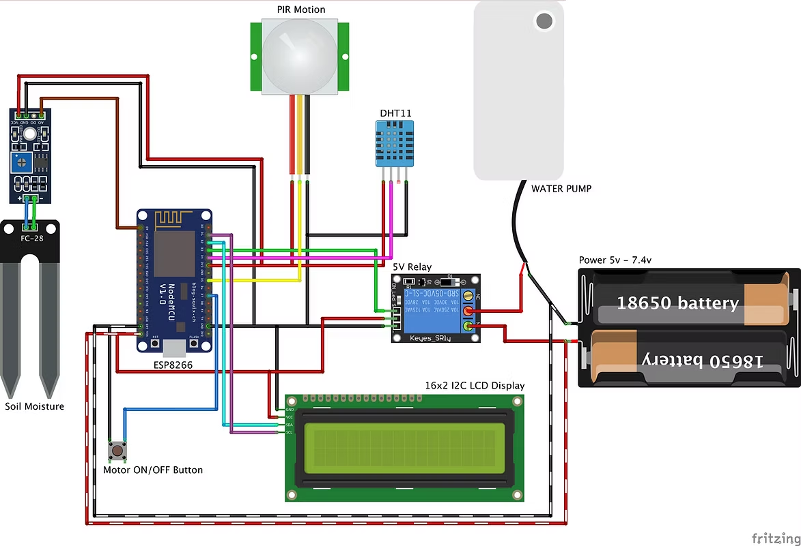

# Smart Plant Monitoring System

This project implements a smart plant monitoring system using an ESP8266 microcontroller, various sensors, and integration with the Blynk platform for remote monitoring and control.

# Project Demonstration

Watch a video demonstration of the project here:

https://github.com/user-attachments/assets/ae654b5d-83c6-42ca-95ff-d33a333d3561


## Features

*   **Temperature & Humidity Monitoring:** Reads ambient temperature and humidity using a DHT11 sensor.
*   **Soil Moisture Detection:** Monitors soil moisture levels to determine watering needs.
*   **Automated Watering:** Controls a water pump based on soil moisture levels.
*   **Manual Pump Control:** Allows manual control of the water pump via the Blynk app.
*   **Motion Detection:** Detects motion using a PIR sensor (though its current function in the code is primarily for reporting).
*   **LCD Display:** Shows real-time sensor data (temperature, humidity, soil moisture, pump status) on a 16x2 I2C LCD.
*   **Blynk Integration:** Sends sensor data to the Blynk cloud and receives commands for pump control, enabling remote monitoring and management.
*   **Serial Monitor Output:** Provides detailed sensor readings and system status via serial communication for debugging and local monitoring.

## Hardware Components

*   ESP8266 Development Board (e.g., NodeMCU, ESP-01)
*   DHT11 Temperature and Humidity Sensor
*   PIR Motion Sensor
*   Soil Moisture Sensor
*   16x2 LCD Display with I2C Module
*   5V Relay Module (for pump control)
*   Small Water Pump
*   Connecting Wires / Jumper Cables
*   Breadboard (optional, for prototyping)
*   Power Supply (appropriate for ESP8266 and sensors)

## Software Setup

### Arduino IDE

1.  **Install Arduino IDE:** If you don't have it already, download and install the [Arduino IDE](https://www.arduino.cc/en/software).
2.  **Add ESP8266 Board Manager:**
    *   Go to `File > Preferences`.
    *   In "Additional Boards Manager URLs", add: `http://arduino.esp8266.com/stable/package_esp8266com_index.json`
    *   Go to `Tools > Board > Boards Manager...`
    *   Search for "esp8266" and install the "esp8266 by ESP8266 Community" package.
3.  **Select ESP8266 Board:** Go to `Tools > Board` and select your specific ESP8266 board (e.g., "NodeMCU 1.0 (ESP-12E Module)").

### Libraries

Install the following libraries in your Arduino IDE via `Sketch > Include Library > Manage Libraries...`:

*   **Blynk:** Search for "Blynk" and install the latest version.
*   **DHT sensor library:** Search for "DHT sensor library by Adafruit" and install it.
*   **LiquidCrystal I2C:** Search for "LiquidCrystal I2C" and install it (ensure it supports I2C for LCD).
*   **Adafruit Unified Sensor:** This is a dependency for the DHT sensor library and should be installed automatically or you may need to install it separately if DHT library fails to compile.

## Configuration

Before uploading the code, you need to configure the following in `arduino.ino`:

1.  **Blynk Template ID, Template Name, and Auth Token:**
    Replace `"YOUR_BLYNK_TEMPLATE_ID"`, `"YOUR_BLYNK_TEMPLATE_NAME"`, and `"YOUR_BLYNK_AUTH_TOKEN"` with your actual values obtained from the Blynk platform.

    ```cpp
    #define BLYNK_TEMPLATE_ID "TMPL3aAXBkedF"
    #define BLYNK_TEMPLATE_NAME "Smart Plant"
    #define BLYNK_AUTH_TOKEN "RH4fEJ6dk6iYt3Gf5Ufg7e9ifcG5F7mu"
    ```

2.  **WiFi Credentials:**
    Update your WiFi SSID and password.

    ```cpp
    char ssid[] = "YOUR_WIFI_SSID";
    char pass[] = "YOUR_WIFI_PASSWORD";
    ```

    *Self-correction: I will update the WiFi credentials to match the ones already in the code, and then add a note about changing them.*

## Wiring Diagram



*(A detailed wiring diagram would go here. For now, a descriptive explanation is provided.)*

*   **ESP8266 to DHT11:**
    *   VCC to 3.3V/5V
    *   GND to GND
    *   Data Pin to D4 (GPIO2)
*   **ESP8266 to PIR Sensor:**
    *   VCC to 3.3V/5V
    *   GND to GND
    *   Out Pin to D5 (GPIO14)
*   **ESP8266 to Soil Moisture Sensor:**
    *   VCC to 3.3V/5V
    *   GND to GND
    *   Analog Out to A0
*   **ESP8266 to Relay Module:**
    *   VCC to 5V (or external 5V if relay requires more current)
    *   GND to GND
    *   IN Pin to D3 (GPIO0)
*   **ESP8266 to LCD I2C Module:**
    *   VCC to 5V
    *   GND to GND
    *   SDA to D2 (GPIO4)
    *   SCL to D1 (GPIO5)

## Usage

1.  **Upload the Code:** Connect your ESP8266 board to your computer. Select the correct board and port in the Arduino IDE, then upload the `arduino.ino` sketch.
2.  **Blynk App Setup:**
    *   Create a new project in the Blynk app using the `BLYNK_TEMPLATE_ID` and `BLYNK_TEMPLATE_NAME` defined in your code.
    *   Add widgets to display temperature, humidity, soil moisture, and a switch for pump control (linked to Virtual Pin V12). Ensure the virtual pins match those used in the code (V0, V1, V3 for sensors, V12 for pump control).
3.  **Monitor:** Observe the sensor data on the LCD, Serial Monitor, and Blynk app. The pump will automatically activate when soil moisture is low, or you can control it manually via the Blynk app.

## Troubleshooting

*   **"Failed to read DHT sensor!"**: Check DHT11 wiring and ensure the DHT sensor library is correctly installed.
*   **LCD Not Displaying:** Verify I2C wiring (SDA, SCL, VCC, GND) and the I2C address of your LCD module (common ones are 0x27 or 0x3F). You can use an I2C scanner sketch to find the correct address.
*   **Blynk Not Connecting:** Double-check your WiFi SSID, password, and Blynk Auth Token. Ensure your ESP8266 has a stable internet connection. 
